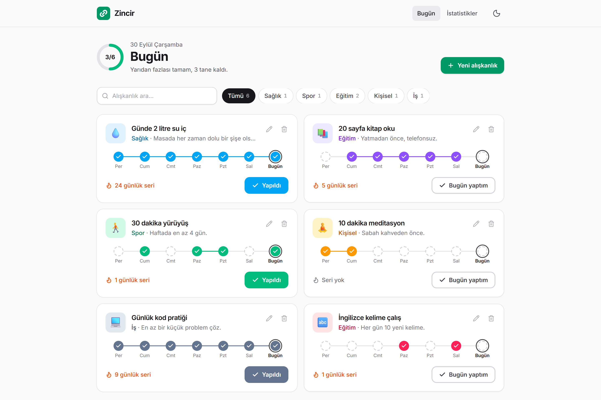
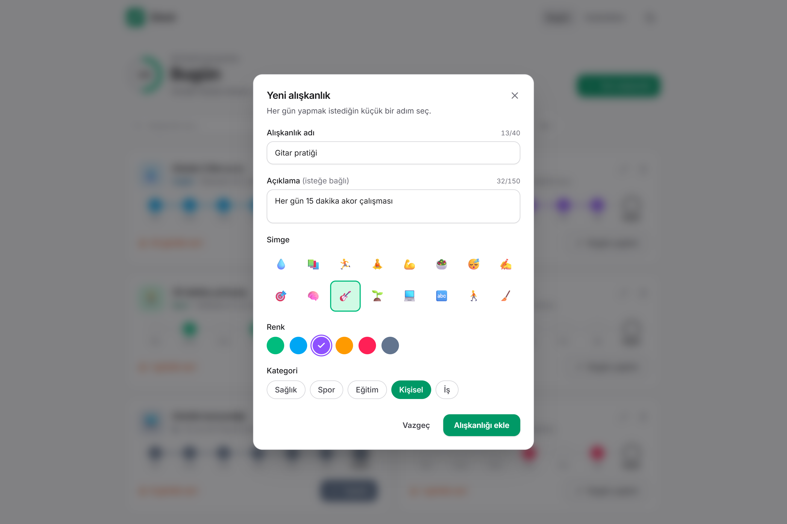
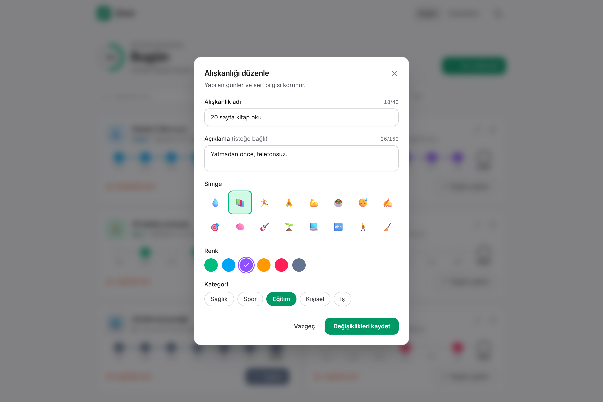
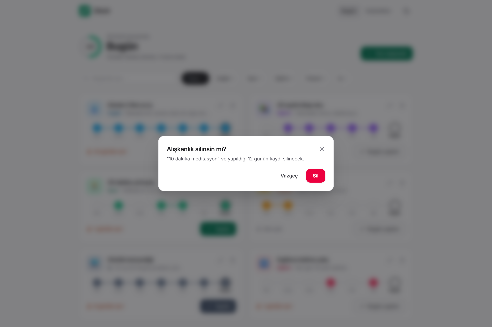
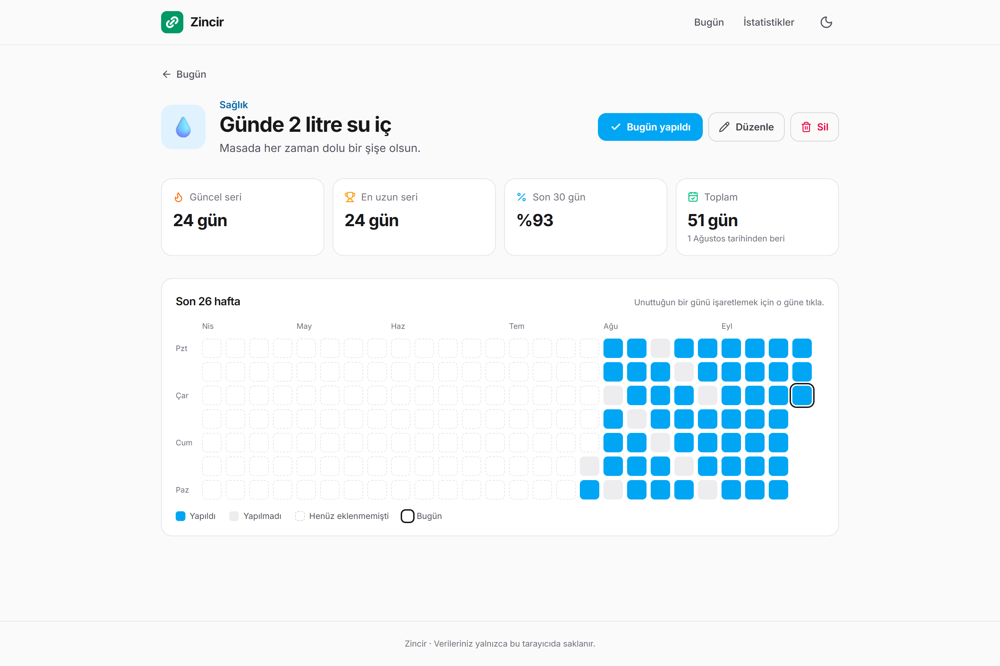
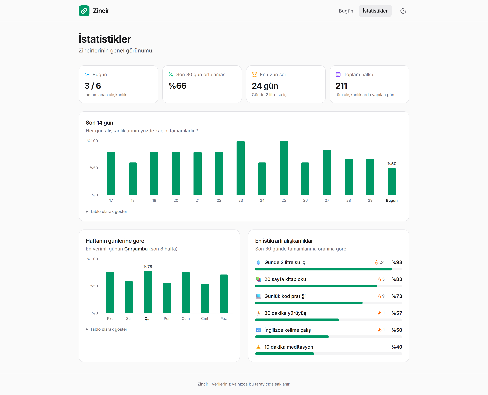
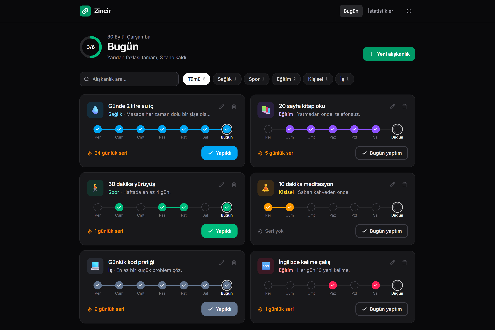
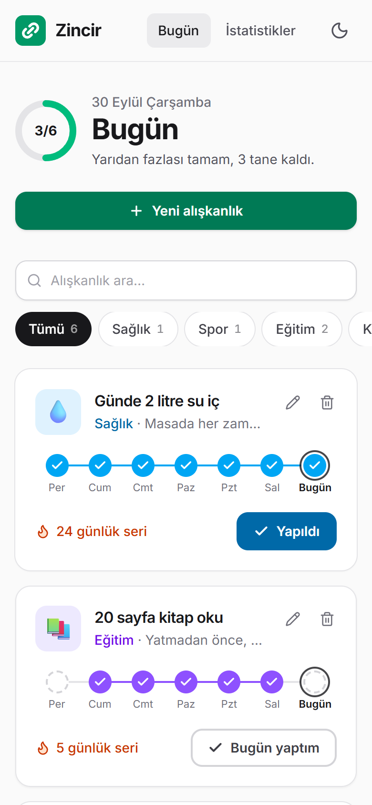

# Zincir — Alışkanlık Takipçisi

**Her gün yaptığın alışkanlığı işaretle, zincirini büyüt.**

Zincir, "zinciri kırma" yöntemine dayanan bir alışkanlık takip uygulamasıdır: her gün yapılan alışkanlık zincire bir halka ekler. Seri takibi, takvim ve istatistiklerle ilerlemeni gösterir. Veriler tarayıcının LocalStorage'ında saklanır; hesap veya sunucu gerekmez.

**Canlı demo:** _Vercel bağlantısı yayından sonra eklenecek_

**Teknolojiler:** React 19 · TypeScript · Vite · Tailwind CSS 4 · React Router · Vitest · Vercel



> Web Geliştirme; JavaScript eğitimi proje yönergesi kapsamında geliştirilmiştir. Yönergedeki TODO App yapısı temel alınmış, her alışkanlık **her gün tekrar eden bir görev** olarak ele alınmıştır.

---

## Özellikler

### Yönergedeki dört işlem

| İşlem | Zincir'de |
|---|---|
| **Ekle** | Ad, açıklama, simge, renk ve kategori ile yeni alışkanlık. Anlık doğrulama, karakter sayaçları, aynı adın tekrarını engelleme (Türkçe büyük/küçük harf duyarsız). |
| **Listele** | Alışkanlık kartları: bugünkü durum, seri, son 7 günün birbirine bağlı halkaları. Günün ilerleme halkası, arama ve kategori filtresi. |
| **Güncelle** | Düzenleme formu (yapılan günler korunur), tek tıkla **"bugün yaptım"**, takvimden **geçmiş günü düzeltme**. |
| **Sil** | Onay penceresi ve bildirimden **"geri al"** (alışkanlık eski sırasına döner). |

### Diğer özellikler

- **Seri takibi:** Güncel seri, en uzun seri, son 30 günün tamamlanma oranı
- **Detay sayfası:** Ekran genişliğine uyumlu takvim (masaüstünde yaklaşık 6 ay)
- **İstatistikler:** Son 14 günün grafiği, haftanın en verimli günü, en istikrarlı alışkanlıklar
- **Karanlık / aydınlık tema:** Sistem tercihine göre açılır, seçim hatırlanır, açılışta yanıp sönme olmaz
- **Mobil uyumlu** tasarım
- **Örnek veri:** Boş uygulamada tek tıkla gerçekçi örnek alışkanlıklar
- **Erişilebilirlik:** Klavyeyle tam kullanım, ekran okuyucu etiketleri, grafikler için tablo görünümü, hareket azaltma tercihine uyum
- **Sağlamlık:** Bozuk veri uygulamayı çökertmez (yedeklenir); depolama dolarsa uyarı verilir; açık sekmeler arası senkron; uygulama açıkken gece yarısı gün kendiliğinden değişir

---

## Yönerge Karşılama Tablosu

| Yönerge maddesi | Projede |
|---|---|
| Modern bir JavaScript kütüphanesi seçimi (Netlify veya muadili ile yayınlanabilir) | **React 19** + **Vite** (statik çıktı) |
| LocalStorage kullanılabilir | Tüm veri LocalStorage'da — [`src/utils/storage.ts`](src/utils/storage.ts) |
| Kütüphane / çerçeve kurulumu, IDE ile açma | `npm create vite` (React + TypeScript), Visual Studio Code |
| `Components`, `Pages`, `Interfaces` klasörleri | [`src/components`](src/components), [`src/pages`](src/pages), [`src/interfaces`](src/interfaces) |
| Tailwind CSS / Bootstrap 5 / Pure CSS | **Tailwind CSS 4** |
| TODO App benzeri; 1 Ekle, 1 Listele, 1 Güncelle, 1 Sil | Yukarıdaki [dört işlem](#yönergedeki-dört-işlem) |
| En az 1 ekran görüntüsü | [8 ekran görüntüsü](#ekran-görüntüleri) |
| GitHub'da public repo | Bu repo |
| Netlify veya muadili ile yayın | **Vercel** ([`vercel.json`](vercel.json)); Netlify için de hazır ([`netlify.toml`](netlify.toml)). Canlı demo bağlantısı yukarıda. |

---

## Kurulum

**Gereksinimler:** [Node.js](https://nodejs.org/) 22.22 veya üzeri

```bash
git clone https://github.com/ademucar/zincir.git
cd zincir
npm install
npm run dev
```

Uygulama **http://localhost:5173** adresinde açılır. İlk açılışta "Örnek alışkanlıkları yükle" ile uygulamayı hemen deneyebilirsiniz.

### Komutlar

| Komut | Açıklama |
|---|---|
| `npm run dev` | Geliştirme sunucusu |
| `npm run build` | Tip kontrolü ve üretim derlemesi (`dist/`) |
| `npm run preview` | Üretim derlemesini yerelde çalıştırır |
| `npm test` | Tüm testler (Vitest) |
| `npm run test:coverage` | Testler + kapsam raporu |
| `npm run lint` | ESLint ile kod denetimi |

---

## Proje Yapısı

```
src/
├── components/     # Yeniden kullanılabilir arayüz parçaları
│                   #   HabitCard, HabitForm, Modal, ConfirmDialog, ChainDots,
│                   #   CalendarHeatmap, ColumnChart, ProgressRing, StatCard, ...
├── pages/          # TodayPage, HabitDetailPage, StatsPage, NotFoundPage
├── interfaces/     # TypeScript arayüzleri: IHabit, IHabitStats, IStorageData
├── context/        # Alışkanlık deposu (reducer + LocalStorage), bildirim bağlamı
├── hooks/          # useHabits, useHabitDialogs, useToday, useTheme, useToast
├── utils/          # Tarih, seri, istatistik, takvim, depolama, doğrulama (+ testleri)
├── constants/      # Renkler, kategoriler, simgeler, örnek veri
├── App.tsx         # Sayfa yönlendirmesi
└── main.tsx
docs/
├── 01-analiz-ve-tasarim.md   # İhtiyaç analizi ve tasarım
└── screenshots/
```

## Teknik Notlar

- **Veri akışı:** `LocalStorage ⇄ habitsStore (reducer) ⇄ useSyncExternalStore ⇄ HabitsProvider ⇄ sayfalar`. Her işlem saf bir reducer'dan geçer ve sonucu hemen kaydedilir. React'in dış veri kaynakları için önerdiği `useSyncExternalStore` kullanıldığından effect ile senkronizasyon gerekmez.
- **Tarihler yerel saate göre tutulur:** Günler `YYYY-MM-DD` anahtarlarıyla saklanır ve `toISOString()` (UTC) kullanılmaz. Aksi halde Türkiye'de gece 00:00–03:00 arasında işaretlenen alışkanlık bir önceki güne yazılırdı.
- **Adil istatistik:** Oranlar hesaplanırken o gün henüz eklenmemiş alışkanlıklar paydaya katılmaz; yeni bir alışkanlık geçmiş günlerin oranını düşürmez.
- **Sürümlü depolama:** Veri `{ version: 1, habits: [...] }` biçiminde saklanır. Okunamayan kayıtlar silinmeden önce yedek anahtara kopyalanır.
- **Tek sayfalı uygulama yönlendirmesi:** `vercel.json` (ve `netlify.toml`) kuralı sayesinde `/aliskanlik/...` gibi adresler doğrudan açıldığında ya da sayfa yenilendiğinde 404 vermez; yönlendirmeyi React Router yapar.

## Testler

```bash
npm test
```

**91 test**, 12 dosya · kod kapsamı **%94** (`npm run test:coverage`)

| Katman | Test edilenler |
|---|---|
| **Arayüz (entegrasyon)** | Yönergedeki dört işlem kullanıcı gibi test edilir: ekle (doğrulama, tekrar eden ad), listele, güncelle (düzenle, bugün yaptım), sil (vazgeç, geri al). Arama / kategori filtresi, detay, istatistik ve bulunamadı sayfaları. — Testing Library + jsdom |
| **Hesaplamalar** | Tarih (ay/yıl geçişi, artık yıl), seri ve oran hesapları, takvim ızgarası, istatistikler, form doğrulama |
| **Veri** | LocalStorage (bozuk veri, dolu depolama), reducer, depo (sekmeler arası senkron) |
| **Zaman** | Tarih hesapları **4 saat diliminde** (İstanbul, UTC, UTC+14, UTC-7) ve yaz saati geçişinde; gece yarısı gün değişimi |

Yayın öncesi ayrıca gerçek tarayıcıda (Edge) **uçtan uca tarama** yapılmıştır: 49 kullanıcı senaryosu, konsol hatası 0, ve 11 ekranda (açık/koyu tema, masaüstü/mobil) **axe-core erişilebilirlik taramasında 0 ihlal** (WCAG AA renk kontrastı dahil).

---

## Ekran Görüntüleri

| Ekle | Güncelle |
|---|---|
|  |  |

| Sil | Detay ve takvim |
|---|---|
|  |  |

| İstatistikler | Karanlık tema |
|---|---|
|  |  |

<p align="center">
  
</p>

---

## Yayın (Vercel)

Uygulama [Vercel](https://vercel.com)'de yayınlanmaktadır. Vercel'de **Add New → Project** ile bu GitHub reposu içe aktarıldığında ayarlar [`vercel.json`](vercel.json)'dan okunur; her `main` güncellemesinde otomatik yeniden yayınlanır.

| Ayar | Değer |
|---|---|
| Framework | Vite |
| Build command | `npm run build` |
| Output directory | `dist` |
| Yönlendirme | Tüm adresler `index.html`'e (React Router) |

Netlify tercih edilirse [`netlify.toml`](netlify.toml) aynı ayarları içerir; ek bir düzenleme gerekmez.
